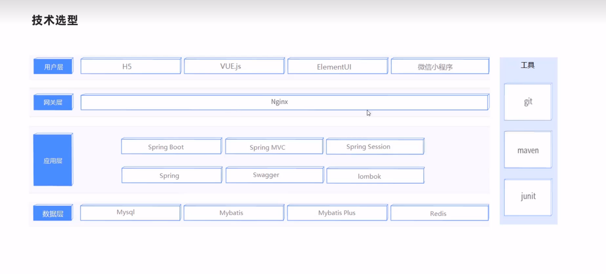
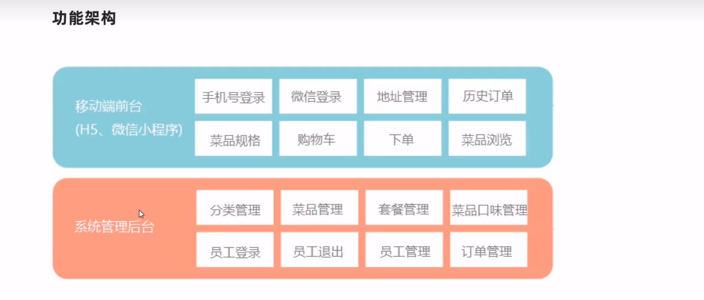
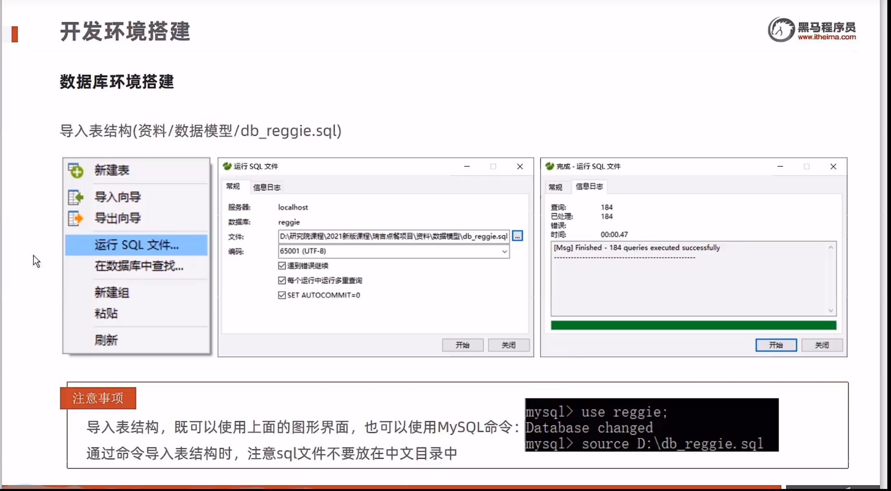
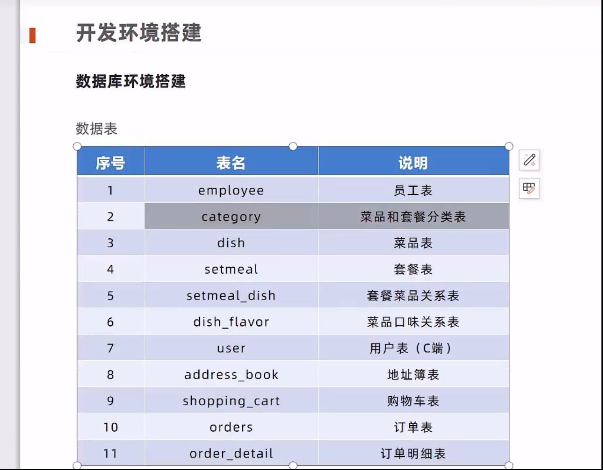

# 黑马程序员Java项目实战《瑞吉外卖》，轻松掌握springboot + mybatis plus开发核心技术的真java实战项目

[黑马程序员Java项目实战《瑞吉外卖》，轻松掌握springboot + mybatis plus开发核心技术的真java实战项目](https://www.bilibili.com/video/BV13a411q753/?spm_id_from=333.788.videopod.episodes&vd_source=0a0dd058ef849bffba564af91a70780d&p=3)

# 1 瑞吉外卖项目

## 1.1 软件开发整体流程

1 软件开发整体流程


2 角色分工


3 软件环境


## 1.2 瑞吉外卖项目整体介绍

**1 项目介绍**

本项目（瑞吉外卖）是专门为餐饮企业（餐厅、饭店）定制的一款软件产品，包括系统管理后台和移动端应用两部分。
其中系统管理后台主要提供给餐饮企业内部员工使用，可以对餐厅的菜品、套餐、订单等进行管理维护。移动端应用主要提供给消费者使用，可以在线浏览菜品、添加购物车、下单等。
本项目共分为3期进行开发：

**第一期**主要实现基本需求，其中移动端应用通过H5实现，用户可以通过手机浏览器访问。
**第二期**主要针对移动端应用进行改进，使用微信小程序实现，用户使用起来更加方便。
**第三期**主要针对系统进行优化升级，提高系统的访问性能。


**2 产品原型**
**产品原型**，就是一款产品成型之前的一个简单的框架，就是将页面的排版布局展现出来，使产品的初步构思有一个可视化的展示。通过原型展示，可以更加直观的了解项目的需求和提供的功能。
**3 技术选型**  



**4 功能架构**


**5 角色**

- 后台系统管理员：登录后台管理系统，拥有后台系统中的所有操作权限
- 后台系统普通员工：登录后台管理系统，对菜品、套餐、订单等进行管理
- C 端用户：登录移动端应用，可以浏览菜品、添加购物车、设置地址、在线下单等

## 1.3 开发环境搭建_数据库环境搭建

1 导入表的结构方式


2 数据库表结构


3 数据库用到的命令

```powershell
mysql --version // 查看数据库版本
mysql -uroot -p // 登录 MySQL 数据库的命令，用来连接本地 MySQL 服务，进入 mysql 命令交互环境
exit    或 quit // 退出数据库交互模式
```

4 本项目数据库名为project_hm_ruiji
