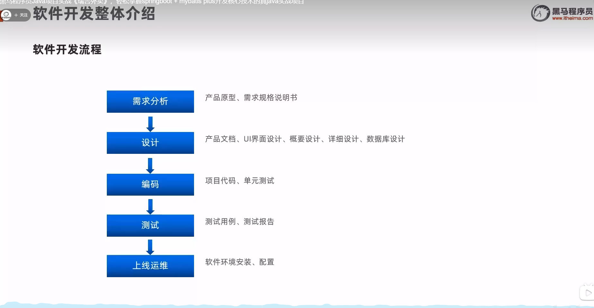
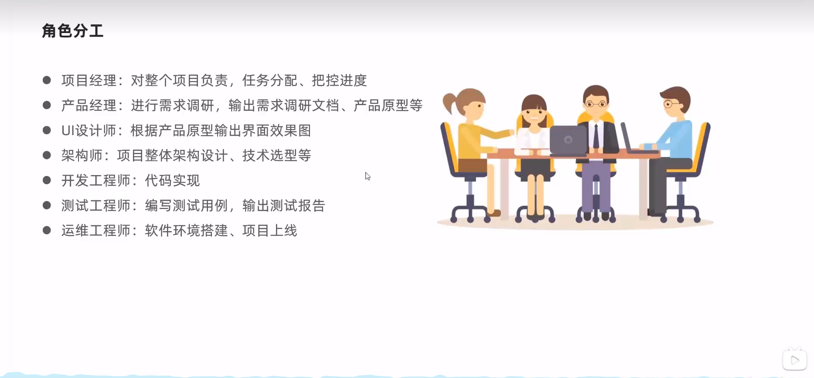

# 黑马程序员Java项目实战《瑞吉外卖》，轻松掌握springboot + mybatis plus开发核心技术的真java实战项目

[黑马程序员Java项目实战《瑞吉外卖》，轻松掌握springboot + mybatis plus开发核心技术的真java实战项目](https://www.bilibili.com/video/BV13a411q753/?spm_id_from=333.788.videopod.episodes&vd_source=0a0dd058ef849bffba564af91a70780d&p=3)

# 1 瑞吉外卖项目

## 1.1 软件开发整体流程

1 软件开发整体流程

2 角色分工

3 软件环境
